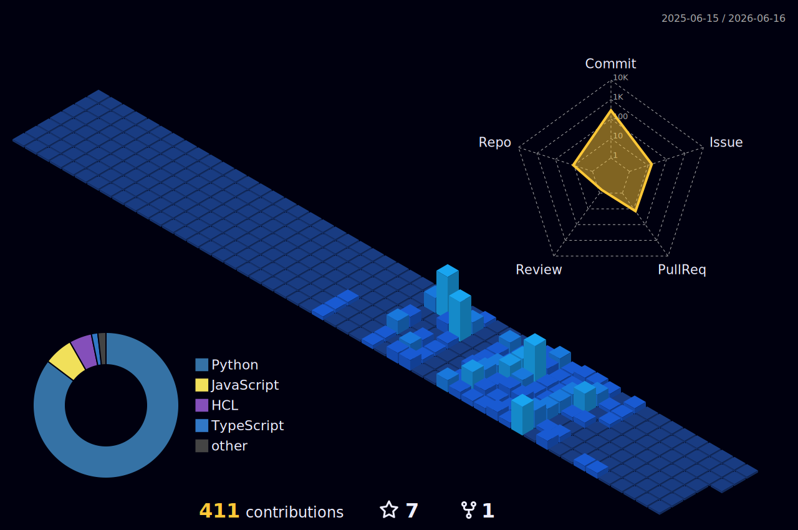

## Hey there 👋

I’m Dhruv, an Electrical Engineering M.S. student at USC focused on Machine Learning. I currently enjoy building clean, efficient ML pipelines and exploring the possibilities of where AI can take us.

These days I’m focused on:

- Machine Learning Theory, specifically Supervised Learning
- Python, Pytorch, Pandas, Scikit-learn
- Small, thoughtful projects with polish

## 🚀 Some projects I have been working on:

- [Apollo-AI-Research-Analyst](https://github.com/Dhruvq/Apollo-AI-Research-Analyst) - Apollo AI is an research assistant that ingests new AI papers from arXiv, filters them and generates biweekly research digests of the most impactful papers. Also features a live Telegram assistant for interactive querying of past research. Check out the video demo [here!](https://dhruvq.github.io/Apollo-AI-Research-Analyst/demo.html)
- [AI Network Degradation Detection](https://github.com/Dhruvq/networkdeg) - An app that predicts short-term network performance degradation using internet telemetry from RIPE Atlas using XGBoost with SMOTE. Check out the current system health [here!](http://54.215.23.12/)
- [Home Cloud](https://github.com/Dhruvq/home-cloud) - A self-hosted compute cluster built from three spare machines using Proxmox VE and Tailscale, featuring GPU passthrough for distributed AI workloads. Enables secure, remote infrastructure for LLM inference, model training, and containerized services.  
- [Wildfire Spread Forecaster](https://github.com/Dhruvq/fire) - An app that predicts wildfire spread over the next 1–8 hours using satellite data, weather forecasts, and terrain conditions, visualized on an interactive 3D map.
- [Counselor AI](https://github.com/Dhruvq/counselorAI/) - A RAG agent designed to assist USC's MS ECE students by answering questions regarding their degree using only official university documentation.

## 💻 Tech Stack:
    

## 📊 GitHub Stats:
<!--   -->
  

